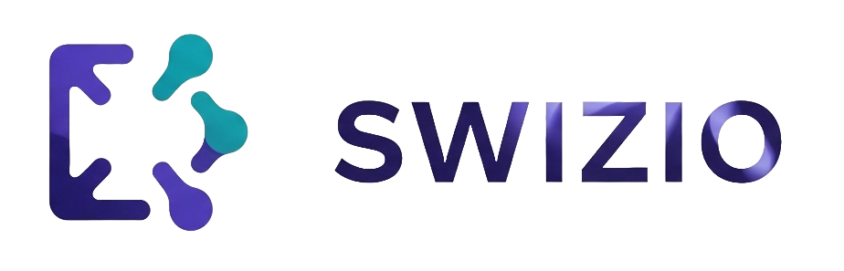

# Swizio 

<div style="text-align: center;">
  
  <h3 style="color: #ccc; font-weight: normal;">
    Transform your imagination into stunning architecture visuals
  </h3>
</div>

  


  [](https://www.python.org/downloads/)
  [](https://fastapi.tiangolo.com/)
  [](https://streamlit.io/)
  [](LICENSE)

## 🚀 Overview

Swizio is an intelligent AI-powered diagram generator that transforms natural language descriptions into professional architecture diagrams. Using advanced LLM agents and the power of Google's Gemini AI, Swizio understands your architectural concepts and automatically generates visual representations with proper component relationships.

### ✨ Key Features

- **Natural Language Processing**: Describe your architecture in plain English
- **Intelligent Component Recognition**: Automatically identifies and suggests appropriate components
- **Professional Diagrams**: Generates clean, publication-ready architecture diagrams
- **Real-time Generation**: Fast diagram creation with live preview
- **Multiple Export Formats**: Download diagrams in PNG format
- **Template Library**: Quick-start templates for common architectures
- **History Management**: Keep track of your generated diagrams
- **RESTful API**: Easy integration with existing workflows

## 🏗️ Architecture

Swizio consists of three main components:

1. **FastAPI Backend**: Handles diagram generation requests and orchestrates the AI agent
2. **LangChain Agent**: Processes natural language and constructs diagrams using specialized tools
3. **Streamlit Frontend**: Provides an intuitive web interface for users

## 🛠️ Technology Stack

- **Backend**: FastAPI, Python 3.10+
- **AI/ML**: LangChain, Google Gemini AI, LangChain Google GenAI
- **Diagram Generation**: Python Diagrams library
- **Frontend**: Streamlit
- **Containerization**: Docker, Docker Compose
- **Testing**: Pytest, HTTPx

## 📋 Prerequisites

- Python 3.10 or higher
- Docker and Docker Compose (optional, for containerized deployment)
- Google Gemini API key

## 🚀 Quick Start

### 1. Clone the Repository

```bash
git clone https://github.com/vladbelms/Swizio.git
cd Swizio
```

### 2. Set Up Environment

Create a `.env` file from the example:

```bash
cp .env.example .env
```

Add your Google Gemini API key to the `.env` file:

```env
GEMINI_API_KEY=your_actual_api_key_here
```

### 3. Installation Options

#### Option A: Local Development

```bash
# Install dependencies
pip install -e .

# Or using uv (recommended)
pip install uv
uv pip install -r pyproject.toml
```

#### Option B: Docker Deployment

```bash
# Build and run with Docker Compose
docker-compose up --build
```

### 4. Run the Application

#### Backend API

```bash
# Start the FastAPI server
uvicorn src.api:app --host 0.0.0.0 --port 8000 --reload
```

The API will be available at `http://localhost:8000`

#### Frontend Interface

```bash
# Start the Streamlit app (in a new terminal)
streamlit run app.py
```

The web interface will be available at `http://localhost:8501`

## 📖 Usage

### Web Interface

1. **Open your browser** and navigate to `http://localhost:8501`
2. **Describe your architecture** in the text area (e.g., "A web application with load balancer, two web servers, and a database")
3. **Click "Generate Diagram"** to create your visualization
4. **Download or save** your generated diagram

### API Usage

Send a POST request to generate diagrams programmatically:

```bash
curl -X POST "http://localhost:8000/diagrams/generate" \
     -H "Content-Type: application/json" \
     -d '{"prompt": "A microservices architecture with API gateway, three services, and databases"}'
```

### Example Prompts

- `"A standard web application with a user, a load balancer, two web servers, and a database"`
- `"An API Gateway with three microservices behind it, each connected to its own database"`
- `"A data pipeline with a Kafka source, a Spark processing cluster, and writing to an S3 bucket"`
- `"A serverless architecture with Lambda functions, API Gateway, and DynamoDB"`

## 🎯 Supported Components

Currently supported diagram components:

- **EC2**: Web servers, application servers, compute instances
- **RDS**: Relational databases, managed database services
- **ALB**: Application Load Balancers, API Gateways
- **User**: End users, clients, external systems

*More components are being added regularly!*

## 🧪 Testing

Run the test suite to ensure everything is working correctly:

```bash
# Install development dependencies
pip install -e ".[dev]"

# Run tests
pytest

# Run tests with coverage
pytest --cov=src tests/
```

## 🔧 Configuration

The application can be configured through environment variables:

| Variable | Description | Required | Default |
|----------|-------------|----------|---------|
| `GEMINI_API_KEY` | Google Gemini API key | Yes | Yes     |

## 📁 Project Structure

```
Swizio/
├── src/
│   ├── __init__.py
│   ├── agent.py          # LangChain agent implementation
│   ├── api.py           # FastAPI application
│   ├── config.py        # Configuration management
│   └── tools.py         # Diagram building tools
├── tests/
│   ├── __init__.py
│   ├── test_api.py      # API endpoint tests
│   └── test_tools.py    # Tool functionality tests
├── app.py               # Streamlit frontend
├── docker-compose.yml   # Docker composition
├── Dockerfile          # Container definition
├── pyproject.toml      # Project configuration
├── .env.example        # Environment template
└── README.md           # This file
```

## 🚀 Development

### Setting Up Development Environment

```bash
# Clone the repository
git clone https://github.com/vladbelms/Swizio.git
cd Swizio

# Install in development mode
pip install -e ".[dev]"

# Install pre-commit hooks (optional)
pre-commit install
```


### Adding New Components

To add support for new diagram components:

1. Import the component class in `src/tools.py`
2. Add it to the `NODE_TYPE_MAP` dictionary
3. Update the agent prompt in `src/agent.py` to include the new component
4. Add tests for the new component

## 🤝 Contributing

We welcome contributions! Please see our contributing guidelines:

1. Fork the repository
2. Create a feature branch (`git checkout -b feature/amazing-feature`)
3. Make your changes
4. Add tests for new functionality
5. Ensure all tests pass (`pytest`)
6. Commit your changes (`git commit -m 'Add amazing feature'`)
7. Push to the branch (`git push origin feature/amazing-feature`)
8. Open a Pull Request

## 📝 License

This project is licensed under the Apache License 2.0 - see the [LICENSE](LICENSE) file for details.

## 🙏 Acknowledgments

- [LangChain](https://langchain.com/) for the agent framework
- [Google Gemini AI](https://ai.google.dev/) for natural language processing
- [Python Diagrams](https://diagrams.mingrammer.com/) for diagram generation
- [FastAPI](https://fastapi.tiangolo.com/) for the robust API framework
- [Streamlit](https://streamlit.io/) for the beautiful web interface

